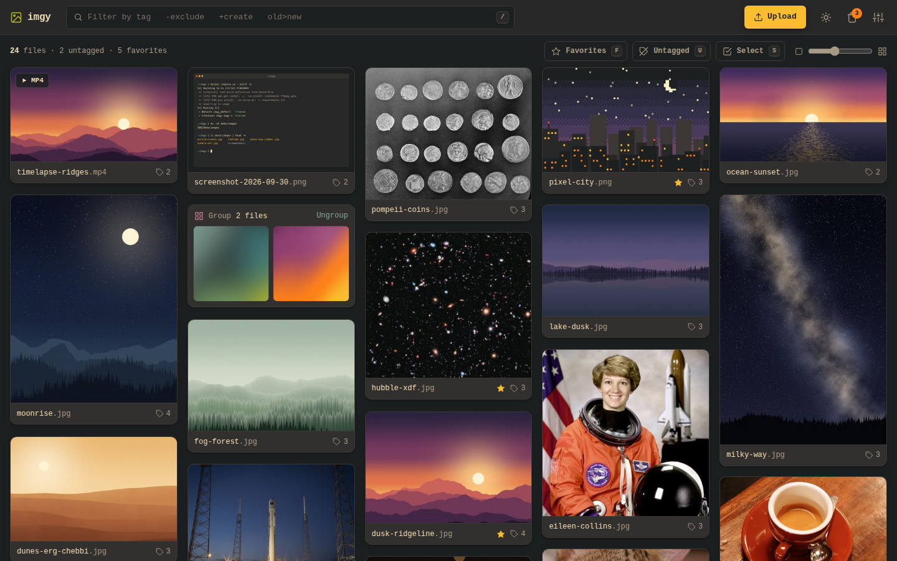
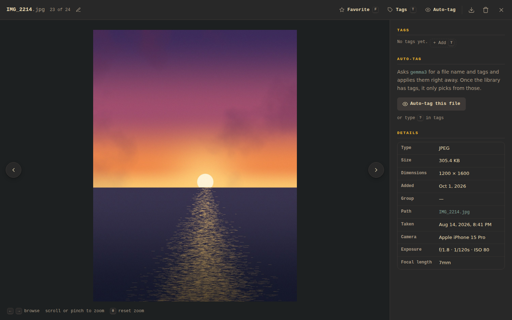

<h1 align="center">Imgy</h1>

<p align="center">
  A local-first image and video organizer 🖼️
</p>

Imgy is a web app for sorting out a big folder of pictures and clips. Tag, search, favorite, group,
and rename your media from the browser, with a tiny tag syntax that keeps your hands on the keyboard.
Your files stay ordinary files in a folder on your own machine, and Imgy only remembers the tags.

**Imgy is not the AI.** Auto-tagging is optional, and Imgy doesn't include or download a model. If
you want it, point Imgy at a vision model you already have: one running on your computer (Ollama,
LM Studio, llama.cpp) or one online (OpenRouter and similar). Anything that speaks the
OpenAI-style chat API works.

<p align="center">
  
  
</p>

- Fast tag editing with a small expression syntax (`+new`, `-remove`, `old>new`, ...)
- Filter by tags, exclusions, file names, favorites, or untagged files
- **Settings › Tags** lists every tag with its file count and deletes one or many at once
- Lightbox with zoom, pan, pinch, and swipe; plays common video formats
- Bulk selection: tag, favorite, group, download as ZIP, or move to trash
- Drag files or groups into your own order (press and hold on a phone); **Settings › Appearance** switches back to newest first
- Trash with restore, inline rename, drag-and-drop upload
- Big libraries open fast: the gallery draws its files in batches and keeps drawing ahead of your scroll
- Press `?` in the app for every keyboard shortcut; `h` `j` `k` `l` move like the arrow keys
- Gruvbox dark and light themes, with a phone layout that keeps the filter in reach of your thumb

> [!WARNING]
> There is no login. Anyone who can reach Imgy can view, change, and delete your files, and can read
> the LLM API key from the settings. Keep it on `localhost` or a network you trust, or put it behind
> an authenticating reverse proxy.

## Quick start

All you need is Git, [uv](https://docs.astral.sh/uv/), and `ffmpeg` (for video thumbnails).

```bash
git clone https://github.com/cavecomputing/imgy.git
cd imgy
uv sync
uv run app.py
```

Then open <http://localhost:5000> in your browser, click **Upload** (or copy files into
`data/images/`), and start tagging.

To run Imgy with Docker instead:

```bash
cd docker
docker compose up --build -d
```

The container runs as UID/GID 1000 by default. To match your host user, start it with
`PUID=$(id -u) PGID=$(id -g) docker compose up --build -d`. Run compose from `docker/`, or from the
repo root with `-f docker/compose.yml`; a `.env` file for these variables goes in `docker/`.

For a production server, run `uv run gunicorn --bind 127.0.0.1:5000 --workers 4 --worker-class gthread --threads 8 --timeout 120 app:app`.

## Your data

```
data/
├── images/            # your media; subfolders are fine
│   ├── .thumbnails/   # generated thumbnails
│   └── .trash/        # files moved to trash
└── database.db        # tags, favorites, groups, custom order, settings
```

The folder is the source of truth: files you copy into `data/images/` show up on the next refresh,
and the database only holds metadata about them. Back up `data/` and you've backed up everything.
Supported types are PNG, JPEG, GIF, WebP, and BMP images and MP4, WebM, MOV, MKV, AVI, and M4V videos.
Hidden folders (names starting with `.`), symlinks, and top-level files whose names start with
`trash:` are skipped.

If thumbnails ever look wrong, **Settings › Storage › Reset thumbnails** deletes them so they're made
again from your files.

## Tag expressions

Type expressions in the tag editor (`T` on an image), the bulk tag editor (`T` with files selected),
or the filter bar (`/`). Separate several with spaces.

| Expression | Tag editor | Bulk tag editor | Filter bar |
|---|---|---|---|
| `tag` | Add an existing tag | Add to every selected file | Show files with the tag |
| `+tag` | Create and add | Create and add to every selected file | Create the tag |
| `-tag` | Remove | Remove from selected files | Hide files with the tag |
| `@text` | | | Show files whose name contains the text |
| `--tag` | | | Delete the tag everywhere |
| `old>new` | Rename on this file | Rename on selected files | Rename everywhere |
| `--` | Remove all tags | Remove all tags from selected files | Delete unused tags |
| `=` | | Give every selected file all their tags | |
| `++` | | Group the selected files | |
| `?` | Auto-tag with the LLM | Auto-tag selected files with the LLM | |

`@text` runs to the end of the line, so it can hold spaces; put it last, as in `sunset @beach house`.
It ignores case, treats spaces, underscores and hyphens alike, and also matches the extension and
folder, so `@.mp4` shows every MP4.

The tag editors preview what each expression will do before you press `Enter`. `Tab` completes the
tag you are typing, and `Enter` applies the expression, or the suggestion you highlighted with the
arrow keys. Destructive filter-bar actions ask for confirmation.

## Auto-tagging (optional)

Imgy can suggest a filename and tags for an image using any OpenAI-compatible chat completions API
with vision support. Videos are not supported.

1. Run a vision model, for example with [Ollama](https://ollama.com/): `ollama pull gemma3`.
2. Open **Settings** (the sliders button in the top bar), go to **Auto-tagging**, choose the
   provider, endpoint, and model, and click **Test connection**. OpenRouter needs an API key.
3. Type `?` in a tag editor, or click **Auto-tag** in the lightbox. Suggestions are applied right
   away; the **Rename the file** and **Add tags** checkboxes control which.

Once your library has tags, the model may only pick from existing tags. **Exclusive tag groups**
limit it to one tag from a set (for example `day`, `night`).

With Docker, `localhost` in the endpoint means the container, not your computer. To reach Ollama on
the host, use `http://host.docker.internal:11434/v1/chat/completions`, start Ollama with
`OLLAMA_HOST=0.0.0.0`, and on Linux add `extra_hosts: ["host.docker.internal:host-gateway"]` to the
service in `docker/compose.yml`.

## Updating

Back up `data/`, then run:

```bash
git pull
uv sync
uv run app.py
```

With Docker, run `git pull` and then `docker compose up --build -d` from `docker/`.

## Using it from another device

Imgy listens only on `localhost` by default, and the Docker compose file publishes on `127.0.0.1`
only, so nothing else on your network can reach it until you say so.

- **Python:** run gunicorn with `--bind 0.0.0.0:5000`.
- **Docker:** change `ports` in `docker/compose.yml` to `"5000:5000"`.

Then open `http://<computer's LAN address>:5000` on your phone. Only do this on a network you trust,
because of the warning above.

| Variable | Default | Description |
|---|---|---|
| `DATA_DIR` | `./data` | Where media and the database are stored |
| `PUID` / `PGID` | `1000` | File owner inside the Docker container |
| `ALLOWED_HOSTS` | `*` | Host names or IPv4 addresses the app answers to besides `localhost`, comma-separated (for example `photos.lan,192.168.1.20`). A leading dot allows subdomains, and `*` allows any host |

Imgy answers to any host name by default. Setting `ALLOWED_HOSTS` makes it refuse every other name,
so a website can't point its own domain at your machine and read your library and API key through
your browser (DNS rebinding).

Behind a reverse proxy, pass the browser's Host header through unchanged, including the port, and
list that name if you set `ALLOWED_HOSTS`. Caddy and Traefik do this by default; for nginx add
`proxy_set_header Host $http_host;`. A proxy that replaces the Host header hides the name from the
app, so the DNS rebinding check can't work, and over plain HTTP every change is refused as
cross-site. Uploads are limited to 500 MB per request.

## Contributing

Imgy is Flask, SQLite, and plain JavaScript, with no build step. See [CLAUDE.md](CLAUDE.md) for the
layout, how to check a change, and the conventions that are easy to miss.
